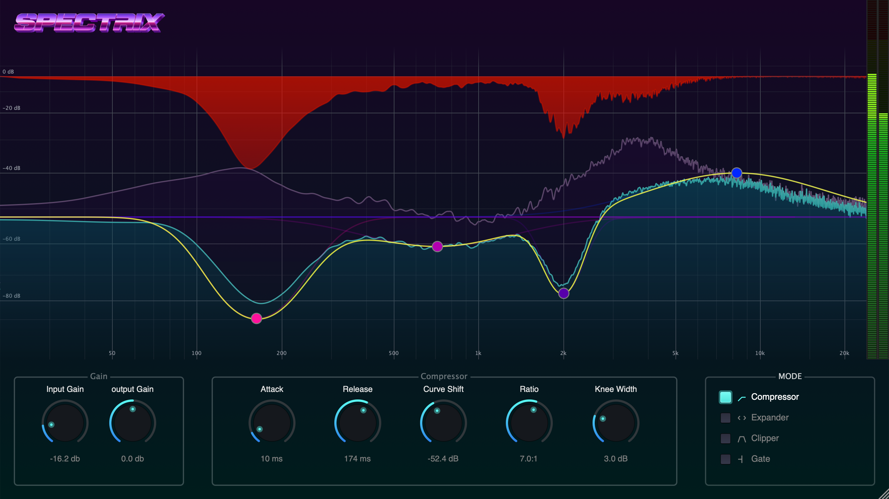

# Spectrix

<div align="center">



**Precision Dynamics in the Frequency Domain.**

[](https://github.com/marantz-dev/Spectrix)
[](https://github.com/marantz-dev/Spectrix)

[Report Bug](https://github.com/marantz-dev/Spectrix/issues) · [Request Feature](https://github.com/marantz-dev/Spectrix/issues)

</div>

---

## Overview

**Spectrix** is an experimental spectral dynamics processor built with [JUCE 8](https://juce.com/). Unlike traditional broadband compressors that react to the entire signal at once, Spectrix breaks your audio into thousands of frequency bands, applying dynamic compression to each one independently.

Whether you need transparent control for mastering or radical spectral sculpting for sound design, Spectrix offers surgical precision.

## Features

- **Spectral Compression:** Tame resonant frequencies without squashing the life out of your mix.
- **Real-time Visualization:** See exactly how your dynamics processing affects the frequency spectrum.
- **Modern Architecture:** Built with C++20 and the latest JUCE 8 framework.
- **Cross-Platform:** Supports macOS and Windows.

## Build Requirements

To build Spectrix from source, ensure you have the following installed:

- **C++ Compiler:** C++20 compatible (Clang, GCC, MSVC, etc.)
- **Build System:** [CMake](https://cmake.org/) (Version 3.22+)

## Getting Started

### 1. Configure JUCE

Spectrix uses CPM to manage dependencies. You can either let the build system download JUCE automatically or point it to your local installation.

**Option A: Download Automatically (Default)**
The `CMakeLists.txt` is already set up to download JUCE 8.0.6.

**Option B: Use Local Installation**
If you prefer to use a local version of JUCE, edit `CMakeLists.txt`:

```cmake
cpmaddpackage(
  NAME JUCE
  SOURCE_DIR "/PATH/TO/YOUR/JUCE" # Update this path
)
```

### 2. Build Instructions

#### macOS (Xcode)

```bash
# 1. Clone the repository
git clone https://github.com/marantz-dev/Spectrix.git
cd Spectrix

# 2. Generate Xcode project
cmake -B build/Xcode -G Xcode

# 3. Build (Debug mode)
cmake --build build/Xcode --config Debug
```

_Open the generated `.xcodeproj` in `build/Xcode` to run or debug._

#### Windows (Visual Studio 2022)

```bash
# 1. Clone the repository
git clone https://github.com/marantz-dev/Spectrix.git
cd Spectrix

# 2. Generate Solution
cmake -B build/VS2022 -G "Visual Studio 17 2022" -A x64

# 3. Build (Debug mode)
cmake --build build/VS2022 --config Debug
```

_Open the generated `.sln` in `build/VS2022` to run or debug._

<div align="center">

_Experimental software - Use with caution on loud systems!_

</div>
